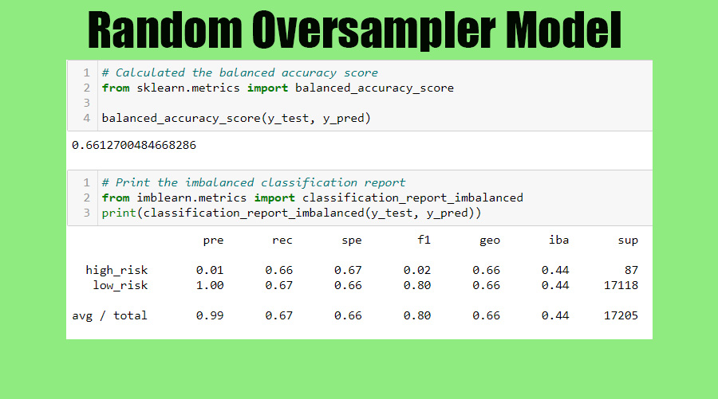
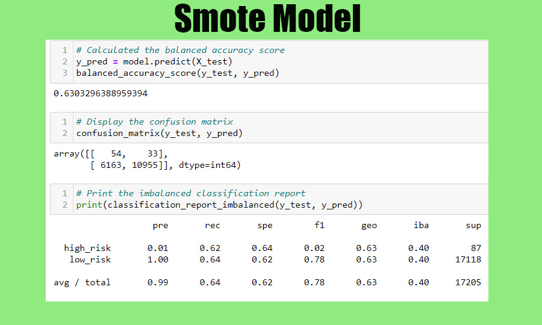
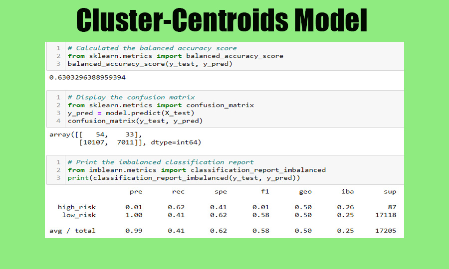
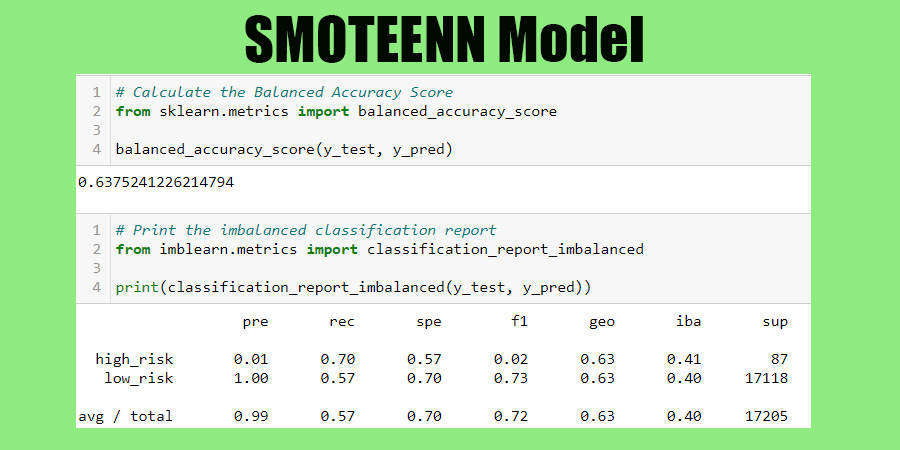
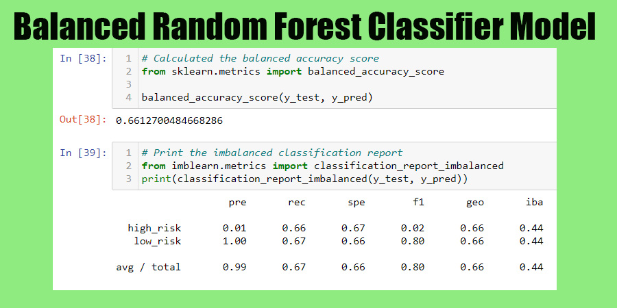
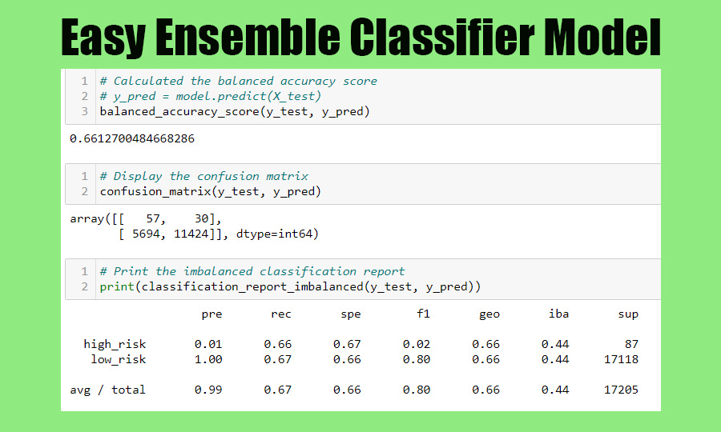

# Credit Risk Analysis

---
## Overview of the loan prediction risk analysis

Credit risk is an unbalanced classification problem due to good loans highly outnumbering risky loans. The following analysis utilized numerous techiniques to train and evaluate models created to analyze loan risk with unbalanced classes. To get the results of this analysis first models were built and evaluated using resampling. The data was then oversampled and undersampled using different algorithms, the bias was reduced to predict credit risk and the performance evaluated based on those results.
 
 
---
## Results of the loan prediction risk analysis

###  Random Over Sampler
   #####    -Balanced Accuracy Score: .66
   #####    -Precision: High Risk: .01 Low Risk: 1.00
   #####    -Recall Scores: High Risk: .66 Low Risk: .67

###  Smote Oversampling
   #####    -Balanced Accuracy Score: .63
   #####    -Precision: High Risk: .01 Low Risk: 1.00
   #####    -Recall Scores: High Risk: .62 Low Risk: .64

###  Cluster Centroids
   #####      -Balanced Accuracy Score: .63
   #####     -Precision: High Risk: .01 Low Risk: 1.00
   #####     -Recall Scores: High Risk: .62 Low Risk: .41

###  SMOTEENN
   #####     -Balanced Accuracy Score: .64
   #####     -Precision: High Risk: .01 Low Risk: 1.00
   #####     -Recall Scores: High Risk: .70 Low Risk: .57

###  Balanced Random Forest Classifier
   #####     -Balanced Accuracy Score: .66
   #####     -Precision: High Risk: .01 Low Risk: 1.00
   #####     -Recall Scores: High Risk: .66 Low Risk: .67

###  Easy Ensemble Classifier
   #####     -Balanced Accuracy Score: .66
   #####     -Precision: High Risk: .01 Low Risk: 1.00
   #####     -Recall Scores: High Risk: .66 Low Risk: .67
 
 
--- 
## Summary of the risk analysis
The results from each model are very similar, since the data is extremely unbalanced. Techinically, The Balanced Random Forest Classifier and the Random Oversampler have a slightly higher balanced accuracy score, so those models are the suggested models from this particular analysis. 

